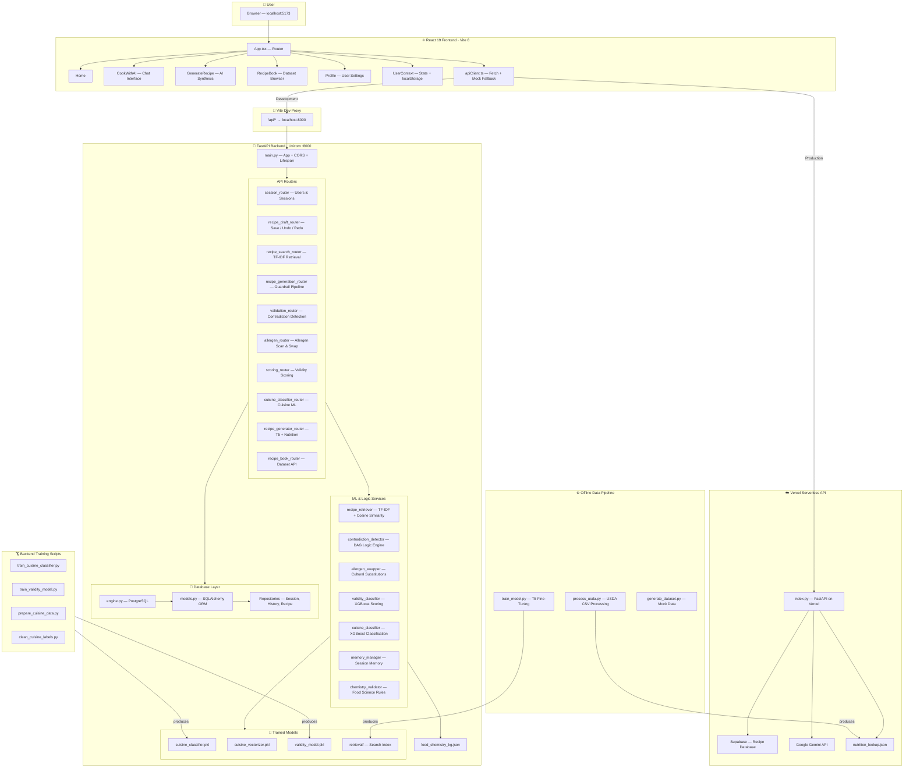
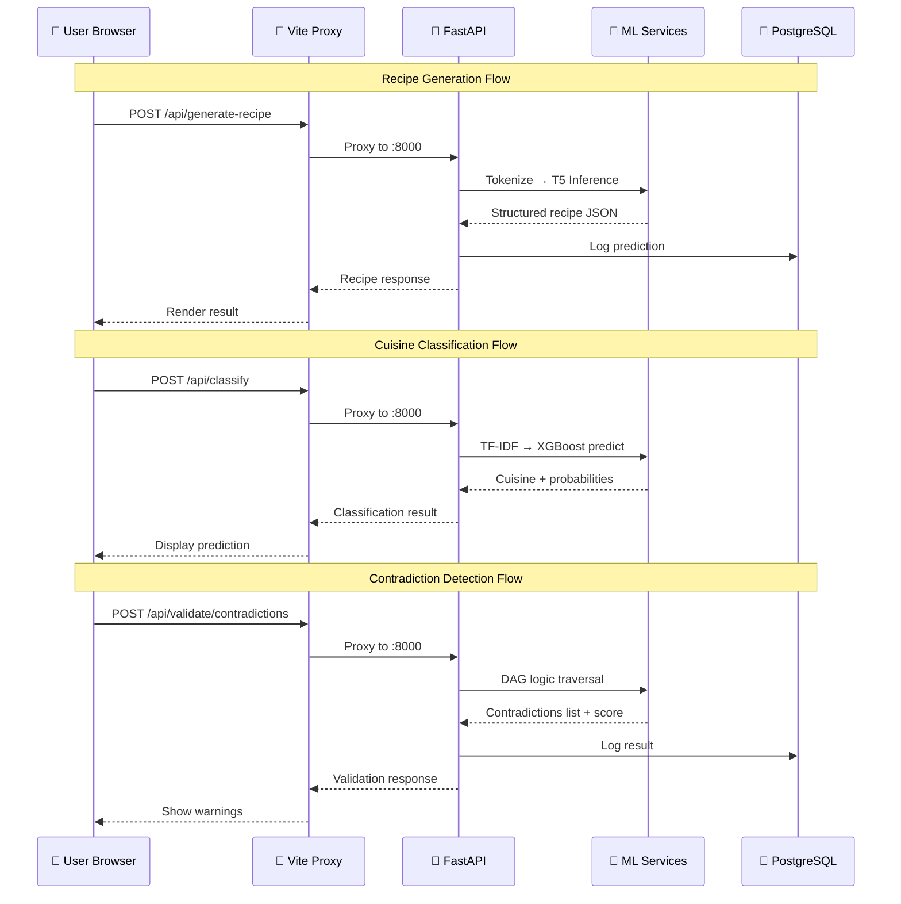
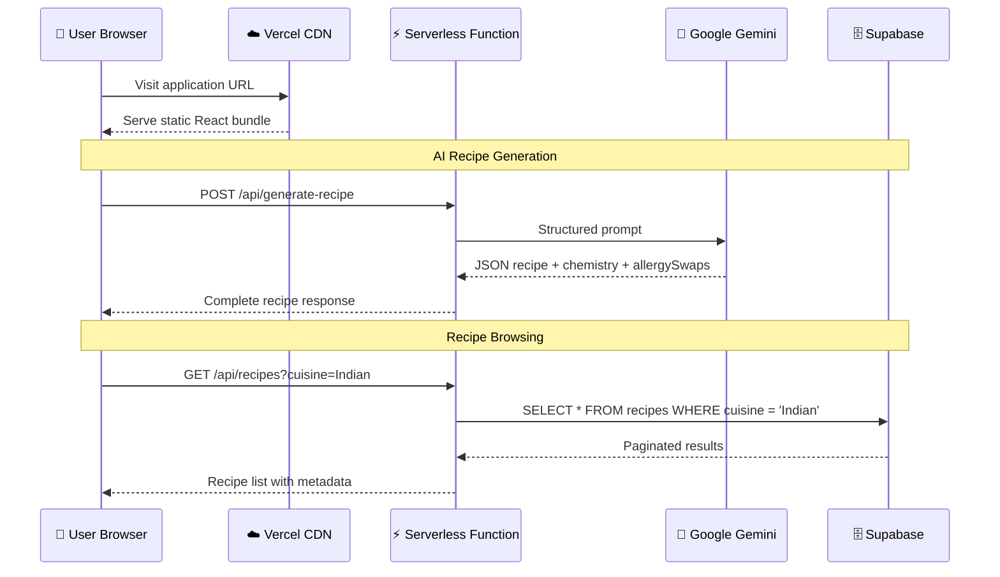

<div align="center">

# 🍳 Sous-Chef AI

### Data-Driven Culinary Architecture

An intelligent web application that fuses **Generative AI** for recipe synthesis with **factual nutritional databases** for precise dietary tracking — powered by a React 19 frontend, a multi-model FastAPI backend, and a Vercel-deployed serverless API.


</div>

---

## Table of Contents

- [System Architecture](#-system-architecture)
- [Technology Stack](#-technology-stack)
- [Machine Learning Pipeline](#-machine-learning-pipeline)
- [Datasets](#-datasets)
- [Project Structure](#-project-structure)
- [Data Flow](#-end-to-end-data-flow)
- [Local Development](#-local-development)
- [Production Deployment](#-production-deployment)
- [Database Schema](#-database-schema)

---

## 🏗 System Architecture

> High-level overview of the full system — from user interaction to data persistence.



---

## 🛠 Technology Stack

### Frontend

| Technology            | Version | Role                                                      |
| --------------------- | ------- | --------------------------------------------------------- |
| **React**             | 19      | Declarative UI component framework                        |
| **Vite**              | 8       | Build tool with Hot Module Replacement and API proxy       |
| **TypeScript**        | 6.0     | Static type checking across the entire frontend            |
| **Tailwind CSS**      | 4.3     | Utility-first styling with a custom Material Design 3 palette |
| **React Router DOM**  | 7.17    | Client-side SPA routing with Vercel rewrite support        |
| **Google Fonts**      | —       | Playfair Display · Space Grotesk · Hanken Grotesk          |
| **Material Symbols**  | —       | Variable-weight icon system                                |

> **Key Patterns:** Global state via `UserContext` with `localStorage` persistence · Built-in mock fallback in `apiClient.ts` when backend is offline · Scroll-driven reveal animations via `IntersectionObserver` · One-time intro splash screen (controlled via `sessionStorage`).

### Backend — Local Development Server

| Technology                  | Role                                                    |
| --------------------------- | ------------------------------------------------------- |
| **FastAPI**                 | Async REST API framework (Uvicorn, port 8000)           |
| **SQLAlchemy**              | ORM — PostgreSQL (primary) with SQLite auto-fallback    |
| **Alembic**                 | Database schema migration management                    |
| **Pydantic / pydantic-settings** | Configuration, request validation, `.env` loading  |
| **XGBoost**                 | Cuisine classification and recipe validity scoring      |
| **scikit-learn**            | TF-IDF vectorization for recipe retrieval               |
| **pandas / NumPy**          | Data processing and feature engineering                 |
| **Docker Compose**          | PostgreSQL 15 Alpine container                          |

> **10 modular API routers** covering: user sessions, recipe drafts with undo/redo, TF-IDF search, generation pipeline, contradiction detection, allergen scanning & swapping, validity scoring, cuisine classification, T5 generation + nutrition lookup, and recipe book browsing.

### Backend — Vercel Serverless (Production)

| Technology              | Role                                                          |
| ----------------------- | ------------------------------------------------------------- |
| **FastAPI on Vercel**   | Serverless Python functions deployed via `api/index.py`       |
| **Supabase**            | Cloud PostgreSQL for recipe storage and paginated querying    |
| **Google Gemini API**   | LLM-powered recipe generation with chemistry analysis         |
| **USDA Nutrition JSON** | Pre-processed factual macronutrient lookup (O(1) dictionary)  |

---

## 🧠 Machine Learning Pipeline

| Model                      | Algorithm                     | Description                                                            |
| -------------------------- | ----------------------------- | ---------------------------------------------------------------------- |
| **Cuisine Classifier**     | XGBoost + TF-IDF Vectorizer   | Predicts cuisine type from an ingredient list with per-class probabilities |
| **Validity Classifier**    | XGBoost Regression            | Scores recipe cookability on a 0–100 scale → `VALID` / `MARGINAL` / `REJECTED` |
| **Recipe Retriever**       | TF-IDF + Cosine Similarity    | Searches the recipe database by ingredient similarity                  |
| **Contradiction Detector** | DAG-based Rule Engine         | Identifies logical/physical conflicts in cooking step sequences        |
| **Allergen Swapper**       | Knowledge-base Rules          | Performs culturally-aware ingredient substitutions for dietary needs    |
| **Chemistry Validator**    | Rule-based Engine             | Validates food science constraints (Maillard reaction, pH, emulsions)  |
| **T5-Small**               | Seq2Seq Transformer (fine-tuned) | Generates complete recipes from raw ingredient lists                |
| **Gemini Flash**           | Google LLM (API)              | Advanced generation with chemistry notes, allergy swaps, heat analysis |

---

## 📊 Datasets

| Dataset                    | Size     | Purpose                                                                  |
| -------------------------- | -------- | ------------------------------------------------------------------------ |
| **RecipeNLG**              | ~2.3 GB  | T5 model fine-tuning — 2.2M+ recipes with NER-parsed ingredient lists    |
| **USDA FoodData Central**  | ~3.2 GB  | Processed into `nutrition_lookup.json` for macronutrient lookup           |
| **Indian Cuisine Images**  | —        | Static image assets served for cuisine classification results            |
| **Food Chemistry KG**      | 307 KB   | JSON knowledge graph encoding chemical interactions between ingredients   |

---

## 📂 Project Structure

```text
Cooking/
│
├── src/                                  # ── REACT 19 FRONTEND ──────────────────
│   ├── components/                       #    21 reusable UI components
│   ├── pages/                            #    8 page-level views
│   ├── context/                          #    UserContext (profiles, chat, saved recipes)
│   ├── data/                             #    mockData.ts — fallback data & TS interfaces
│   ├── utils/                            #    apiClient.ts, cooklangParser.ts, imageUtils.ts
│   ├── index.css                         #    Tailwind directives & custom CSS animations
│   ├── App.tsx                           #    Routing + scroll-reveal observer
│   └── main.tsx                          #    React DOM entry with BrowserRouter
│
├── backend/                              # ── FASTAPI BACKEND (LOCAL) ────────────
│   ├── main.py                           #    Server entry point — 10 routers, CORS, lifespan
│   ├── config.py                         #    Pydantic settings (DB, model paths, thresholds)
│   ├── routers/                          #    10 modular API endpoint modules
│   ├── services/                         #    7 ML & business logic service modules
│   ├── db/                               #    SQLAlchemy engine, ORM models, SQLite file
│   ├── repositories/                     #    Data access layer (session, history, recipe)
│   ├── models/                           #    Trained .pkl model files + retrieval index
│   ├── knowledge_graph/                  #    food_chemistry_kg.json (307 KB)
│   ├── training/                         #    XGBoost training scripts (cuisine & validity)
│   ├── scripts/                          #    Data loading & Supabase migration utilities
│   ├── datasets/                         #    Indian cuisine image assets
│   ├── alembic/                          #    Database migration files
│   ├── tests/                            #    Test suite
│   └── requirements.txt                  #    Python dependencies
│
├── api/                                  # ── VERCEL SERVERLESS FUNCTIONS ────────
│   ├── index.py                          #    FastAPI app (Gemini + Supabase + Nutrition)
│   ├── process_usda.py                   #    USDA CSV → nutrition_lookup.json processor
│   ├── train_model.py                    #    T5-Small fine-tuning on RecipeNLG
│   ├── generate_dataset.py               #    Mock recipe dataset generator
│   └── requirements.txt                  #    Vercel Python dependencies
│
├── sous-chef-app/                        #    Earlier project iteration (archived)
│
├── docker-compose.yml                    #    PostgreSQL 15 Alpine container
├── vercel.json                           #    Routing: /api/* → serverless, /* → SPA
├── vite.config.ts                        #    Vite config with /api proxy to :8000
├── tailwind.config.js                    #    Material Design 3 color system & typography
├── index.html                            #    HTML entry (Google Fonts, Material Symbols)
└── package.json                          #    React 19, Vite 8, Tailwind CSS 4
```

---

## 🔄 End-to-End Data Flow

### Phase 1 · Data Pre-processing (Offline)

> **Goal:** Transform 3.2 GB of raw USDA CSVs into a fast, factual lookup table.

1. **`process_usda.py`** reads the massive `food_nutrient.csv` in chunks of **1,000,000 rows** using `pandas`.
2. Filters exclusively for macronutrients — Calories (IDs 1008/2047), Protein (1003), Fat (1004), Carbs (1005).
3. Merges with `food.csv` descriptions and applies a <40-character heuristic to retain only base ingredients.
4. **Output →** `nutrition_lookup.json` — a compact dictionary enabling O(1) ingredient-to-macronutrient lookup.

### Phase 2 · ML Model Training (Offline)

#### T5 Recipe Generator — `api/train_model.py`

1. Loads the pre-trained `t5-small` checkpoint and a 50K-sample subset of RecipeNLG via HuggingFace `datasets`.
2. Formats each example as: **Input** `"generate recipe: chicken, garlic"` → **Target** `"Title: ... | Ingredients: ... | Directions: ..."`.
3. Fine-tunes using HuggingFace `Trainer` with PyTorch and FP16 mixed precision (when GPU is available).
4. **Output →** `trained_recipe_model_final/` directory containing the fine-tuned model and tokenizer.

#### XGBoost Classifiers — `backend/training/`

1. **Cuisine Classifier:** TF-IDF vectorization of ingredient lists → XGBoost multi-class classification.
2. **Validity Classifier:** Feature extraction from recipe structure → XGBoost regression for cookability scoring.
3. **Output →** `.pkl` model files serialized to `backend/models/`.

### Phase 3 · Live Backend Server



| Endpoint                           | Function                                                            |
| ---------------------------------- | ------------------------------------------------------------------- |
| `/api/nutrition/{ingredient}`      | O(1) dictionary lookup from `nutrition_lookup.json`                 |
| `/api/generate-recipe`             | T5 tokenization → inference → structured JSON parsing               |
| `/api/classify`                    | TF-IDF vectorization → XGBoost prediction with per-class probabilities |
| `/api/recipe/score`                | Feature extraction → XGBoost regression → VALID / MARGINAL / REJECTED |
| `/api/validate/contradictions`     | DAG-based logical constraint checking on cooking step sequences     |
| `/api/allergens/scan`              | Rule-based allergen scanning against user dietary profiles          |
| `/api/allergens/swap`              | Culturally-aware ingredient substitution using a knowledge base     |

### Phase 4 · Vercel Production Deployment



1. **Static Frontend** — Vite production build served via Vercel CDN.
2. **Serverless API** (`api/index.py`) — Standalone FastAPI instance integrating Gemini for generation and Supabase for storage.
3. **Recipe Generation** — Gemini produces structured JSON containing title, ingredients, directions, chemistry notes, allergy swaps, and heat requirements.
4. **Recipe Browsing** — Paginated queries to Supabase with cuisine filtering and full-text search.

### Phase 5 · Frontend User Experience

| Feature                  | Implementation                                                                      |
| ------------------------ | ----------------------------------------------------------------------------------- |
| **Intro Splash**         | Animated splash screen shown once per session (`sessionStorage` flag)               |
| **Multi-User Profiles**  | `UserContext` with dietary preferences, saved recipes, chat history in `localStorage` |
| **AI Chat**              | `CookWithAI` — real-time conversational cooking assistant                           |
| **Recipe Synthesis**     | `GenerateRecipe` — ingredient input → animated loading → full recipe with chemistry |
| **Recipe Book**          | `RecipeBook` — paginated grid with cuisine filters and search                       |
| **Offline Resilience**   | Every `apiClient.ts` call has a built-in mock fallback for offline operation         |

---

## 🚀 Local Development

### Prerequisites

| Requirement         | Version    |
| ------------------- | ---------- |
| **Node.js**         | 18+        |
| **Python**          | 3.14+      |
| **Docker**          | Latest     |

### 1. Start the Database

```bash
docker-compose up -d
```

### 2. Backend Setup

```bash
cd backend
pip install -r requirements.txt
uvicorn main:app --reload --port 8000
```

<details>
<summary><strong>Optional: Build USDA Nutrition Lookup</strong></summary>

```bash
cd api
python process_usda.py
```

Processes 3.2 GB of USDA CSVs into a compact `nutrition_lookup.json` file.
</details>

<details>
<summary><strong>Optional: Train T5 Model (requires GPU)</strong></summary>

```bash
cd api
python train_model.py
```

Fine-tunes `t5-small` on a 50K subset of RecipeNLG. Full dataset training requires significant GPU resources.
</details>

### 3. Frontend Setup

```bash
# From the project root
npm install
npm run dev
```

Open **http://localhost:5173** — the Vite proxy automatically routes all `/api/*` requests to the backend on port 8000.

---

## ☁️ Production Deployment

The project is configured for **Vercel** deployment out of the box.

### Environment Variables

| Variable          | Description                              |
| ----------------- | ---------------------------------------- |
| `SUPABASE_URL`    | Supabase project URL                     |
| `SUPABASE_KEY`    | Supabase anonymous/public key            |
| `GEMINI_API_KEY`  | Google Gemini API key for AI generation   |

### Routing Configuration (`vercel.json`)

| Pattern       | Destination         | Purpose                  |
| ------------- | ------------------- | ------------------------ |
| `/api/(.*)`   | `/api/index.py`     | Serverless API functions |
| `/(.*)`       | `/index.html`       | SPA client-side routing  |

---

## 🗄 Database Schema

The SQLAlchemy ORM defines **9 tables** across user management, recipe versioning, and ML audit logging:

| Table                  | Primary Key        | Description                                                  |
| ---------------------- | ------------------ | ------------------------------------------------------------ |
| `users`                | `user_id` (UUID)   | Registered user identity                                     |
| `sessions`             | `session_id` (UUID)| Cooking sessions linked to users with activity timestamps    |
| `recipe_drafts`        | `draft_id` (UUID)  | Versioned recipe snapshots with incremental version numbers  |
| `recipe_history`       | `history_id` (UUID)| Undo/redo action stack (CREATE, MODIFY, ALLERGEN_SWAP, REDO) |
| `contradiction_logs`   | `id` (auto)        | Contradiction detection audit trail                          |
| `allergen_profiles`    | `id` (auto)        | User allergy and dietary preference profiles                 |
| `substitution_logs`    | `id` (auto)        | Ingredient substitution registry with reasoning              |
| `recipe_predictions`   | `id` (auto)        | Validity score predictions with feature-level breakdowns     |
| `recipes`              | `id` (auto)        | Recipe dataset with nutritional data and cuisine metadata    |

---

<div align="center">

**Built with ❤️ by Swatadru**

*Sous-Chef AI — Where Culinary Art Meets Machine Intelligence*

</div>
