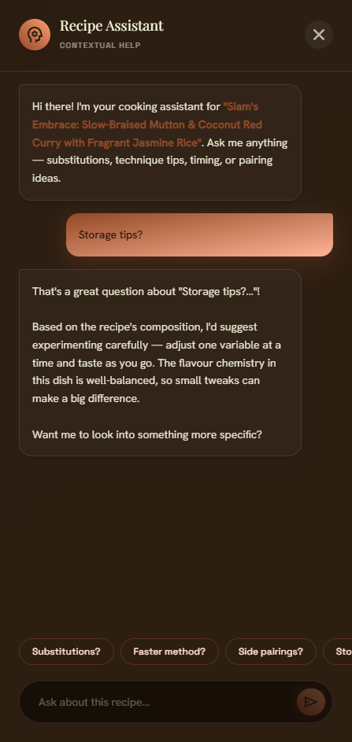
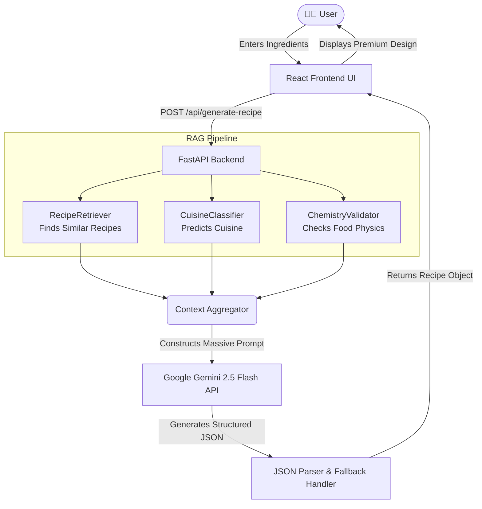

<div align="center">
  <h1>🍳 Sous-Chef AI</h1>
  <p><strong>Data-Driven Culinary Architecture powered by Gemini RAG</strong></p>

  [](https://reactjs.org/)
  [](https://fastapi.tiangolo.com/)
  [](https://tailwindcss.com/)
  [](https://ai.google.dev/)
  
  <br />
</div>



<br/>

Sous-Chef AI is an intelligent, modern web application that combines the power of Generative AI (via Google Gemini) with Retrieval-Augmented Generation (RAG) and factual nutritional databases. It seamlessly blends a highly responsive Vite/React frontend with a high-performance Python/FastAPI backend powered by modern ML pipelines.

---

## 🏗️ Architecture & Technologies

### 1. Frontend Technologies
- **Framework:** React 18 with Vite for lightning-fast HMR and building.
- **Routing:** `react-router-dom` for SPA navigation (configured for Vercel deployment).
- **Styling:** Tailwind CSS (PostCSS) with a custom design system featuring glassmorphism, advanced micro-animations, rich gradients, and responsive layouts.
- **API Communication:** Standard `fetch` API proxied through Vite directly to the backend.

### 2. Backend Technologies
- **Framework:** FastAPI (Python) running on Uvicorn, providing high-speed async REST API endpoints.
- **Data Processing:** `pandas` and standard JSON processing for handling data pipelines.
- **Generative AI:** Google Gemini 2.5 Flash model accessed via the official `google-genai` SDK.

### 3. The RAG Engine (Retrieval-Augmented Generation)
Instead of relying solely on the LLM's internal knowledge, the backend employs a multi-step RAG pipeline to ground the AI's generations in reality:
- **RecipeRetriever:** A retrieval system that searches a database of existing recipes to provide the AI with realistic culinary inspiration based on user ingredients.
- **CuisineClassifier:** An ML classifier that predicts the optimal global cuisine profile (e.g., Indian, Mediterranean, Asian) based on the input ingredients.
- **ChemistryValidator:** A validation layer that checks food chemistry and physical cooking rules (e.g., Maillard reaction temperatures, acid/base balances) to prevent the AI from generating physically impossible instructions.

---

## 🔄 System Flowchart



---

## 📂 Project Folder Structure

```text
Cooking/
│
├── sous-chef-app/                  # VITE / REACT FRONTEND
│   ├── src/
│   │   ├── components/             # Reusable UI elements (RecipeTroubleshooter, RecipeDetailModal)
│   │   ├── pages/                  # Main views (Home, CookWithAI, etc.)
│   │   ├── data/                   # Fallback mock data and TypeScript interfaces
│   │   ├── utils/                  # API clients (apiClient.ts)
│   │   ├── index.css               # Global Tailwind directives & custom CSS animations
│   │   ├── App.tsx                 # Main routing logic
│   │   └── main.tsx                # React DOM entry point
│   ├── vercel.json                 # Vercel deployment configuration for SPA routing
│   ├── vite.config.ts              # Vite config (includes API proxy to localhost:8000)
│   └── package.json                # Node.js dependencies
│
├── backend/                        # PYTHON / FASTAPI BACKEND
│   ├── main.py                     # The FastAPI server entry point
│   ├── routers/
│   │   └── recipe_generator_router.py # Core Gemini RAG endpoints
│   ├── services/                   # RAG Pipeline Components
│   │   ├── recipe_retriever.py
│   │   ├── cuisine_classifier.py
│   │   └── chemistry_validator.py
│   └── requirements.txt            # Python dependencies (FastAPI, google-genai)
```

---

## 🔄 Step-by-Step Data Flow & Explanation

Here is exactly how the entire system works from end-to-end when a user generates a recipe.

### Phase 1: Context Collection (The RAG Pipeline)
*Goal: Gather grounded, factual data to feed the AI.*

1. **User Request:** The user submits a list of ingredients (e.g., `["chicken", "lemon", "garlic"]`) from the Vite frontend to the FastAPI `/api/generate-recipe` endpoint.
2. **Retrieval:** The `RecipeRetriever` searches an existing recipe database for top matches (top_k=3) containing those ingredients. This grounds the AI with realistic culinary combinations.
3. **Classification:** The `CuisineClassifier` analyzes the ingredients and predicts the most logical cuisine profile (e.g., "Mediterranean").
4. **Validation:** The `ChemistryValidator` evaluates the ingredients against known food science rules (e.g., warning the AI about curdling if mixing high acid with dairy).

### Phase 2: AI Generation (Gemini 2.5 Flash)
*Goal: Synthesize a highly structured, delicious, and scientifically sound recipe.*

1. **Prompt Engineering:** The backend constructs a massive prompt containing the base ingredients, the retrieved inspiration recipes, the predicted cuisine guidance, and the strict food chemistry rules.
2. **Structured Output:** The backend uses the official `google-genai` SDK and passes a strict Pydantic schema (`response_schema`) to force the Gemini model to return a perfectly formatted JSON object. 
3. **Generation:** Gemini processes the context and returns the recipe, including precise macros, step-by-step directions, chemistry notes, and tailored allergy swap options.

### Phase 3: The Frontend User Experience
*Goal: Give the user a beautiful, interactive interface.*

<div align="center">
</div>


<br/>

1. **State Management:** While waiting for the API, the React app displays animated typing indicators and loading states.
2. **Rendering:** Once the JSON is received, it populates the main UI. 
3. **Contextual Help (Troubleshooter):** The user can click a "Recipe Assistant" floating action button. This opens a premium, glassmorphic chat drawer (`RecipeTroubleshooter.tsx`) where they can ask contextual questions like "Substitutions?" or "Faster method?".
4. **Allergen Scanning:** The frontend cross-references the user's profile with the recipe to flag allergens and seamlessly swap ingredients via the backend logic.

---

## 🚀 How to Run the Project Locally

### 1. Backend Setup
1. Ensure **Python 3.10+** is installed.
2. Open a terminal in the `backend/` directory.
3. Install dependencies:
   ```bash
   pip install -r requirements.txt
   ```
4. Set up your Gemini API Key in your environment variables:
   ```bash
   export GEMINI_API_KEY="your_api_key_here"
   ```
5. Start the FastAPI server:
   ```bash
   uvicorn main:app --reload
   ```

### 2. Frontend Setup
1. Open a new terminal in the `sous-chef-app/` directory.
2. Install Node dependencies:
   ```bash
   npm install
   ```
3. Start the Vite development server:
   ```bash
   npm run dev
   ```
4. Open `http://localhost:5173` in your browser. The app will automatically proxy API requests to your local Python backend!
